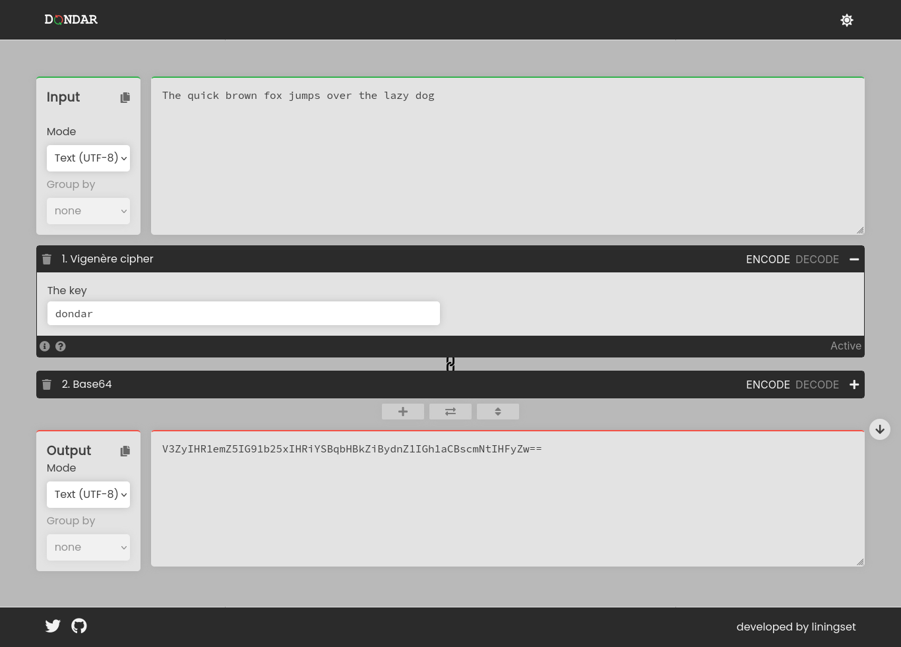
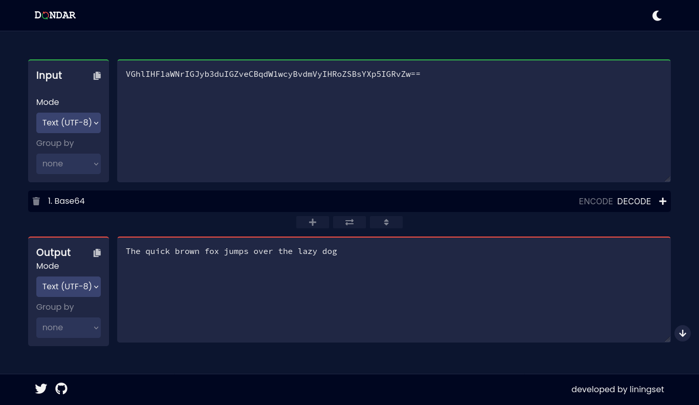

# Dondar - The swiss army knife of text madness

<p align="center" width="100%">
  
</p>

A feature-rich versatile web app with clean UI that allows you to transform any text via the collection of encoding algorithms implemented natively within


---

## 📚 Table of Contents

- [Features](#features)
- [Screenshots](#screenshots)
- [Tech Stack](#tech-stack)
- [Installation](#installation)

---

## ✨ Features

- type in on the input field and recieve transformed text on the other side
- add/remove operations or chain onto existing ones to make text transform using multiple algorithms
- disable/enable a sepecific algorithm without deleting it or messing up the entire order
- light/dark mode supported
- choose whether to encode or decode if a certain algorithm is asymmetrical

---

## 🖼️ Other screenshots



---

## 🛠️ Tech Stack

- **React 18.3**
- **Sass (SCSS)**
- **Bootstrapped with create-react-app**
- **compatible with node v16**

---

## 📦 Installation

#### 1. Clone the repository

```bash
git clone https://github.com/liningset/dondar.git
cd dondar
```

#### 2. Start the development server

```bash
npm install
npm start
```
